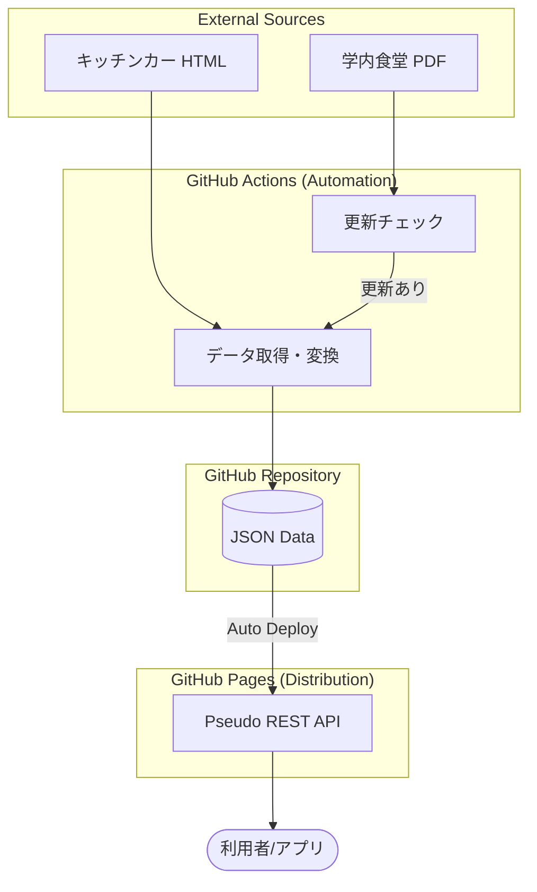

# harapeco spec

学内のWebサイト、キッチンカー情報から情報を取得し、GitHub Pages を利用して公開するプロジェクトの仕様書です。

## データ取得

### 学内食堂

- 空いている食堂は https://www.kyoto-su.ac.jp/campus/welfare/ からリンクされている pdf ファイルから取得できる。
- GitHub Actions を利用して、毎朝 7 時に PDF を見に行き、HTTP ヘッダから更新されているかを確認する。
- 更新されていればダウンロードし、PDF をテキストに変換して、空いている食堂の情報を抽出する。
- 抽出した情報は JSON 形式で保存する。
- 取得した JSON データは、GitHub Pages を利用して公開する。

### キッチンカー

- キッチンカーの出店スケジュールは https://schedule.mellow.jp/ss_web/markets/KqTl8N から取得できる。
- この URL から HTML を取得し、店名、出店日時、URL を抽出する。
- 取得した情報を JSON 形式で保存する。

## システム構成

GitHub Actions を利用してデータの収集・変換を行い、GitHub Pages を通じて JSON データを配信する構成をとる。



## ディレクトリ構成

プロジェクトのディレクトリ構造は以下の通り。

- `.github/`
  - `workflows/`: データ取得・デプロイ用の GitHub Actions 定義
  - `assets/`: 仕様書や図解などのアセット
- `scripts/`: データの取得、変換、加工を行うスクリプト群（Python/Node.js等）
- `daily/`: （必要に応じて）取得した元データや日次のバックアップ
- `public/`: GitHub Pages で公開される静的ファイル
  - `api/`: 生成された JSON データ（擬似 REST API）

## エラーハンドリングと通知

自動実行における異常検知と対応方針。

### 異常時の対応

- **スクレイピング失敗:** 
  - サイト構造の変化等でスクレイピングに失敗した場合、GitHub Actions のログにエラーを記録し、GitHub Issue を自動作成する。
  - GitHub の標準機能により、リポジトリのオーナー/購読者に通知（メール等）が送信される。
- **データ件数が 0 件の場合:**
  - 取得結果が 0 件だった場合、既存の JSON データを上書きせず、処理を中断する。
  - この場合も異常として扱い、通知を行う。

### 通知方法

- GitHub Actions の実行失敗通知を利用する。通知の受け取り方（メール、ブラウザ通知、モバイル等）は各ユーザーの GitHub プロフィール設定に従う。

## 開発環境のセットアップ

本プロジェクトの開発には **Bun** を使用する。

### ツールチェーン

- **ランタイム:** Bun (TypeScript)
- **パッケージ管理:** `bun install`
- **フォーマッタ/リンター:** `bun fmt`, `bun lint` (またはプロジェクトで設定したツール)

### ローカルでの実行方法

```bash
# 依存関係のインストール
bun install

# スクリプトの実行（例）
bun run scripts/main.ts

# テストの実行
bun test
```

## 非機能要件

運用上の制約および品質に関する定義。

### データの鮮度と更新頻度

- **更新タイミング:** 毎日午前 7:00 (JST) に GitHub Actions を実行し、ソースの更新を確認する。
- **反映遅延:** GitHub Pages (Fastly CDN) のキャッシュにより、データの更新から実際に API に反映されるまで数分程度のタイムラグが発生する場合がある。

### データの正確性（免責事項）

- 本プロジェクトは、京都産業大学公式サイトおよび Mellow 社の公開情報を機械的に収集して提供するものである。
- ソース元の急な変更（当日の臨時休業やメニュー変更など）がリアルタイムに反映されない可能性がある。
- 提供される情報の正確性についてはいかなる保証も行わず、本 API の利用により生じた損害について責任を負わない。

## データ構造定義

本プロジェクトでは、リポジトリ内のマスタデータとスクレイピング結果を合成し、単一の JSON データを生成する。

### 1. 公開データ (`api/schedule/today`)

利用者（アプリ）が取得するメインのデータ。店舗マスタの情報と当日の営業状況が統合されている。

```typescript
{
  "date": string,         // 対象日 (YYYY-MM-DD)
  "last_updated": string, // データ取得・生成日時 (ISO8601)
  "cafeterias": [
    {
      "id": string,       // 一意識別子
      "name": string,     // 表示名称
      "location": string, // 建物・階層
      "url": string,      // 公式サイトURL
      "google_map": string, // 地図URL
      "image_url": string,  // 店舗画像URL
      "start_time": string, // 今日の開始 (HH:mm)
      "end_time": string,   // 今日の終了 (HH:mm)
      "business_hours": string, // 営業時間のテキスト表現
      "note": string      // 備考
    }
  ],
  "kitchen_cars": [
    {
      "id": string,       // 店舗ID
      "name": string,     // 店舗名
      "url": string,      // 公式詳細URL
      "image_url": string, // 店舗画像URL
      "location": string, // 今日の出店場所
      "start_time": string, // 今日の開始 (HH:mm)
      "end_time": string    // 今日の終了 (HH:mm)
    }
  ]
}
```

### 2. 店舗一覧（マスタ） (`api/shops`)

全店舗の基本情報（名称、場所等）のリスト。`api/shops/{id}` を呼び出すための ID 一覧としても使用する。

```typescript
{
  "cafeterias": [
    {
      "id": string,
      "name": string,
      "location": string,
      "url": string,
      "google_map": string,
      "image_url": string
    }
  ],
  "kitchen_cars": [
    {
      "id": string,
      "name": string,
      "url": string,
      "image_url": string
    }
  ]
}
```

### 3. 週間スケジュール (`api/schedule/weeks/{n}`)

相対的な週番号（0: 今週, 1: 来週, 2: 再来週）で指定する 7 日分のまとめデータ。

```typescript
{
  "week_index": number,    // 指定された週番号
  "start_date": string,    // 開始日
  "end_date": string,      // 終了日
  "last_updated": string,
  "daily_schedules": [
    // api/schedule/today と同等の構造が日付分並ぶ
  ]
}
```

### 4. 店舗詳細と今後の予定 (`api/shops/{id}`)
特定の店舗（食堂またはキッチンカー）の基本情報と、取得可能な範囲の今後のスケジュール。

```typescript
{
  "id": string,
  "name": string,
  "type": "cafeteria" | "kitchen_car",
  "location": string,       // 基本の場所
  "url": string,
  "google_map": string,
  "image_url": string,
  "schedules": [
    {
      "date": string,       // YYYY-MM-DD
      "location": string,   // その日の出店場所（キッチンカー等の場合）
      "start_time": string, // HH:mm
      "end_time": string,   // HH:mm
      "note": string
    }
  ]
}
```

### 5. API ステータス (`api/status`)

データの最終更新日時や、現在提供可能なデータの範囲を返す軽量なメタデータ。

```typescript
{
  "last_updated": string,  // 最終更新日時
  "data_range": {
    "start": string,       // 保持している最古の日付
    "end": string          // 保持している最新の日付
  },
  "shop_count": number     // 登録店舗数
}
```

### 6. 内部管理データ (リポジトリ内)

- `scripts/master.json`: 全店舗の不変情報（名前、URL等）を管理する。

## データの公開

### 擬似 REST API

GitHub Pages を利用し、以下のエンドポイントで JSON データを配信する。

#### スケジュール（日付・期間ベース）

- **本日:** `https://<user>.github.io/harapeco/api/schedule/today`
- **昨日:** `https://<user>.github.io/harapeco/api/schedule/yesterday`
- **明日:** `https://<user>.github.io/harapeco/api/schedule/tomorrow`
- **特定の日付:** `https://<user>.github.io/harapeco/api/schedule/YYYY-MM-DD`
- **週間スケジュール:** `https://<user>.github.io/harapeco/api/schedule/week` (今週) または `api/schedule/weeks/{n}` (n=0: 今週, 1: 来週...)

#### 店舗情報（店舗ベース）

- **店舗一覧（マスタ）:** `https://<user>.github.io/harapeco/api/shops`
- **店舗詳細と予定:** `https://<user>.github.io/harapeco/api/shops/{id}`

#### その他

- **API ステータス:** `https://<user>.github.io/harapeco/api/status`

### 実装上の注意

- GitHub Actions の実行時に、当日分だけでなく、翌日の予定（取得可能な場合）や過去の履歴も静的ファイルとして生成・配置することで、日付指定のアクセスを実現する。
- 拡張子なしのアクセスを実現するため、GitHub Pages 上では `api/schedule/today` という名前のファイル、または `api/schedule/today/index.json` として配置する。
